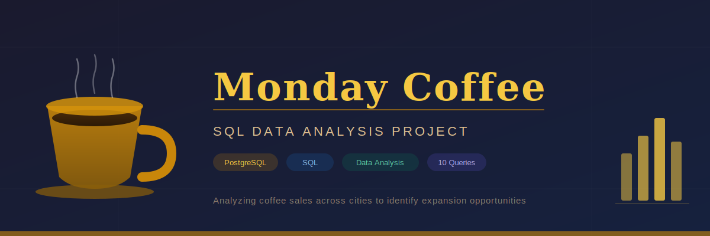

# ☕ Monday Coffee — SQL Data Analysis Project



## Project Overview

**Monday Coffee** is an end-to-end SQL data analysis project exploring coffee sales performance across multiple Indian cities. The goal is to answer 10 real business questions using PostgreSQL — from basic revenue reporting to market potential analysis — and produce a final recommendation on which cities are best suited for new branch expansion.

---

## Business Problem

Monday Coffee has been selling its products online since January 2023. The company now wants to expand its physical presence and open new coffee shop locations across India. This analysis uses sales data to identify the top 3 cities for expansion based on revenue, customer base, rent affordability, and estimated coffee demand.

---

## Database Schema

The project uses 4 tables:

```
city          →  city_id, city_name, population, estimated_rent, city_rank
customers     →  customer_id, customer_name, city_id
products      →  product_id, product_name, price
sales         →  sale_id, sale_date, product_id, customer_id, total
```

**Entity Relationships:**
```
city ──< customers ──< sales >── products
```

---

## Questions Answered

| # | Business Question | Key Concept |
|---|-------------------|-------------|
| Q1 | Coffee consumer count per city (25% of population) | Arithmetic, ORDER BY |
| Q2 | Total revenue from coffee sales — Q4 2023 | Multi-table JOIN, EXTRACT, GROUP BY |
| Q3 | Units sold per coffee product | LEFT JOIN, COUNT, GROUP BY |
| Q4 | Average sales amount per customer per city | JOIN, SUM, COUNT DISTINCT, ROUND |
| Q5 | City population vs estimated coffee consumers | CTE, LEFT JOIN |
| Q6 | Top 3 selling products in each city | Window function — DENSE_RANK, PARTITION BY |
| Q7 | Unique customers per city who purchased coffee | COUNT DISTINCT, multi-table JOIN |
| Q8 | Average sale vs average rent per customer per city | CTE, ratio calculation |
| Q9 | Monthly sales growth rate by city | LAG / growth % (time series) |
| Q10 | Market potential analysis — top 3 city recommendation | CTE, multi-metric ranking |

---

## Key Findings & Recommendation

After analyzing revenue, customer count, rent affordability, and estimated coffee demand, the top 3 recommended cities for expansion are:

### 🥇 Jaipur
- Very low average rent per customer
- High average sales per customer (~11.6K)
- Strong customer base (69 unique customers)

### 🥈 Delhi
- Highest estimated coffee consumers in any city
- Largest customer base (68 unique customers)
- Rent per customer still manageable (~330)

### 🥉 Pune
- Strong revenue performance
- Good revenue-to-rent ratio
- Consistent sales growth quarter over quarter

---

## SQL Techniques Used

- Multi-table `JOIN` (2 and 3 table joins)
- `LEFT JOIN` for inclusive aggregations
- `GROUP BY` with `HAVING`
- `EXTRACT(YEAR ...)` and `EXTRACT(QUARTER ...)` for date filtering
- `ROUND`, `SUM`, `COUNT`, `COUNT(DISTINCT ...)`
- **CTEs** (`WITH ... AS`) for multi-step logic
- **Window functions** — `DENSE_RANK() OVER (PARTITION BY ... ORDER BY ...)`
- Subqueries in `FROM` clause
- Type casting with `::numeric`

---

## Files in This Repository

```
monday-coffee-analysis/
│
├── README.md                      ← You are here
├── monday_coffee_banner.png       ← Project banner
│
├── schema/
│   └── create_tables.sql          ← Table definitions + sample data
│
└── queries/
    ├── q1_coffee_consumers.sql
    ├── q2_total_revenue_q4.sql
    ├── q3_sales_count_per_product.sql
    ├── q4_avg_sales_per_city.sql
    ├── q5_population_vs_consumers.sql
    ├── q6_top3_products_per_city.sql
    ├── q7_unique_customers_per_city.sql
    ├── q8_avg_sale_vs_rent.sql
    ├── q9_monthly_sales_growth.sql
    └── q10_market_potential_analysis.sql
```

---

## How to Run

1. Install [PostgreSQL](https://www.postgresql.org/download/)
2. Create a new database:
   ```sql
   CREATE DATABASE monday_coffee;
   ```
3. Run the schema file to create tables and insert data:
   ```bash
   psql -d monday_coffee -f schema/create_tables.sql
   ```
4. Open any query file in your SQL client (pgAdmin, DBeaver, or psql) and run it

---

## Tools Used

- **PostgreSQL 15** — database engine
- **pgAdmin 4** — query editor and schema browser
- **Git & GitHub** — version control

---

## Author

**Ramy**  
Data Analyst | SQL · Python · Power BI · dbt  
📧 Connect via email

---

## Learning Notes

This project was built as part of a structured analytics portfolio targeting real business domains. The analysis follows the framework: *"I found X → means Y → so do Z → which recovers $W"* — translating raw data into a concrete expansion recommendation.

> Every query here was written from a business question first, not from the data first.
